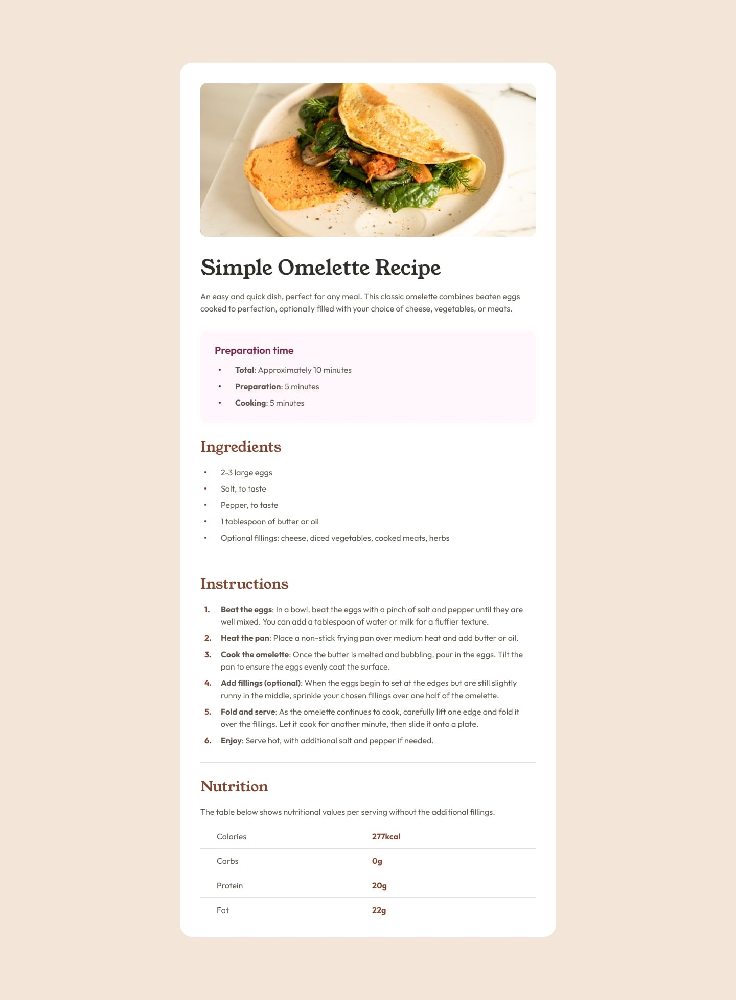

# Frontend Mentor - Recipe page solution

This is a solution to the [Recipe page challenge on Frontend Mentor](https://www.frontendmentor.io/challenges/recipe-page-KiTsR8QQKm). Frontend Mentor challenges help you improve your coding skills by building realistic projects. 

## Table of contents

- [Overview](#overview)
  - [Screenshot](#screenshot)
  - [Links](#links)
- [My process](#my-process)
  - [Built with](#built-with)
  - [What I learned](#what-i-learned)
  - [Continued development](#continued-development)
- [Author](#author)

## Overview

### Screenshot



### Links

- Solution URL: [GitHub](https://github.com/4y0ub-kkkk/recipe-page-main)
- Live Site URL: [Site](https://4y0ub-kkkk.github.io/recipe-page-main/)

## My process

### Built with

- Semantic HTML5 markup
- CSS custom properties
- Mobile-first workflow

### What I learned

- I learn that start building the site with large with then moving to the mobile is a stupid idea and cost you a lot of time !!

- I leaned also how to use the property border-collapse to style the table borders !

```CSS
.nutrition table {
  width: 100%;
  text-align: left;
  border-collapse: collapse;
}
```

### Continued development

In the next challenge I want to focus more about:
  - Organising the html better with sematic tags.
  - Control padding, margin better.
  - Mobile-first design.


## Author

- Frontend Mentor - [4y0ub_kkkk](https://www.frontendmentor.io/profile/4y0ub-kkkk)
